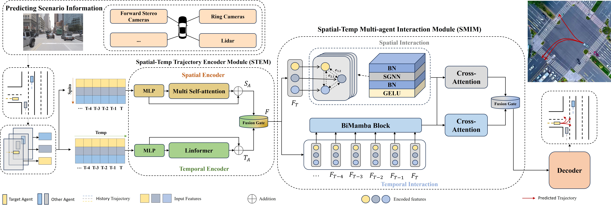

# SGmNet
Lightweight Map-Free Trajectory Prediction forAutonomous Driving Using SubequivariantGraph Neural Networks and Mamba TemporalModeling

## result
### viz

### COMPARSION OF SEVERAL PREDICTION METHODS EVALUTED ON ARGOVERSE TEST SET
| Methods     | Models          | minADE6 ↓ | minFDE6 ↓ | MR ↓    |
|-------------|-----------------|-----------|-----------|---------|
| **Map-free**    |                 |           |           |         |
|             | NN        | 1.71      | 3.28      | 0.54    |
|             | CRAT-Pred   | 1.06      | 1.90      | 0.26    |
|             | MEATP     | 1.13      | 2.07      | -       |
| **Map-based**   |                 |           |           |         |
|             | DATF        | 1.13      | 2.50      | -       |
|             | MTPLA      | 0.99      | 1.71      | 0.19    |
|             | TNT        | 1.22      | 1.56      | 0.12    |
|             | mmTransformer  | 0.84   | 1.32      | 0.15    |
|             | HiVT       | 0.83      | 1.31      | 0.15    |
|             | **Ours (map-free)** | 0.99 | 1.73 | 0.23|

### COMPARSION OF SEVERAL PREDICTION METHODS EVALUTED ON ARGOVERSE VALIDATION SET
| Methods     | Models          | minADE6 ↓ | minFDE6 ↓ | MR ↓ |
|-------------|-----------------|-----------|-----------|------|
| **Map-free**    |                 |           |           |      |
|             | CRAT-Pred [10]  | 0.85      | 1.44      | 0.17 |
|             | LaneGCN* [8]    | 0.79      | 1.29      | -    |
|             | Tpen [45]       | 0.82      | 1.32      | 0.15 |
| **Map-based**   |                 |           |           |      |
|             | DATF [42]       | 0.92      | 1.52      | -    |
|             | DenseTNT [39]   | 0.80      | 1.27      | 0.07 |
|             | mmTransformer [44] | 0.72   | 1.21      | 0.09 |
|             | DESIRE [46]     | 1.09      | 1.89      | -    |
|             | TNT [38]        | 0.91      | 1.10      | 0.09 |
|             | LaPred [47]     | 0.71      | 1.44      | -    |
|             | LaneGCN [8]     | 0.72      | 1.10      | -    |
|             | Ours (map-free)| 0.79*| 1.25 | 0.16 |
> **Note:** \* indicates a map-based model that we excluded the map module to perform map-free predictions.

### ABLATION
| Spatial-Att | Linformer | SGNN | BiMamba | minADE6 ↓ | minFDE6 ↓ |
|-------------|-----------|------|---------|-----------|-----------|
| -           | -         | ✓    | ✓       | 0.93      | 1.68      |
| ✓           | -         | ✓    | ✓       | 0.90      | 1.60      |
| -           | ✓         | ✓    | ✓       | 0.83      | 1.35      |
| ✓           | ✓         | -    | -       | 1.00      | 1.67      |
| ✓           | ✓         | -    | ✓       | 0.91      | 1.61      |
| ✓           | ✓         | ✓    | -       | 0.85      | 1.42      |
| ✓           | ✓         | ✓    | ✓       | **0.79**  | **1.25**  |